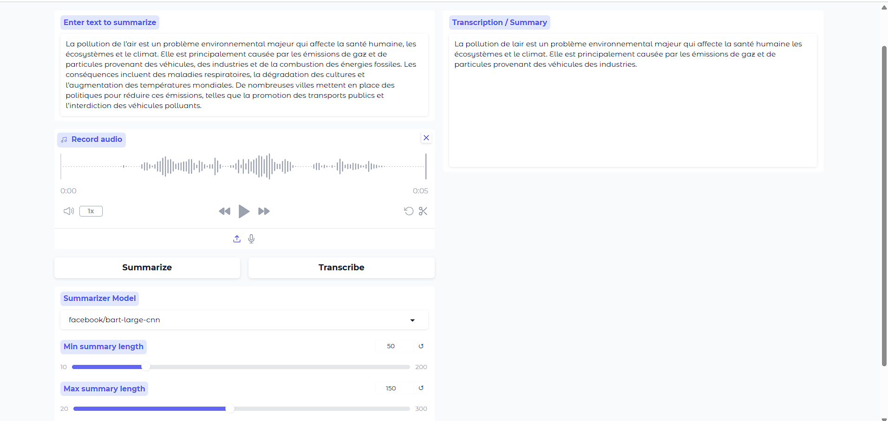

# Voice & Text Summarizer

This project provides a simple interface for transcribing audio and summarizing text using state-of-the-art machine learning models. It features a Gradio web app for easy interaction.

## Features

- **Audio Transcription:** Record or upload audio and get English transcriptions using a fine-tuned Whisper model.
- **Text Summarization:** Paste or type text and generate concise summaries using BART models.
- **Customizable:** Choose summarization model and adjust summary length and beam search parameters.

## Interface & Testing

### Dark Theme


### Light Theme & Example Test


## Usage

### 1. Local Setup

1. Clone the repository:
   ```bash
   git clone <your-repo-url>
   cd trans_summarize
   ```

2. Install dependencies:
   ```bash
   pip install -r requirements.txt
   ```

3. Run the Gradio app:
   ```bash
   python gradio_app.py
   ```

4. Access the web interface at [http://localhost:7860](http://localhost:7860).

### 2. Using Docker

1. Build the Docker image:
   ```bash
   docker build -t trans-summarizer .
   ```

2. Run the container:
   ```bash
   docker run -p 7860:7860 trans-summarizer
   ```

3. Open [http://localhost:7860](http://localhost:7860) in your browser.

## File Structure

- `gradio_app.py`: Main Gradio web app.
- `src/transcribtion_summarizer/`: Source code for transcription and summarization.
- `requirements.txt`: Python dependencies.
- `Dockerfile`: Docker configuration.

## Notes

- The app uses HuggingFace models and requires internet access for initial downloads.
- For best results, use clear audio recordings and well-formed text.

## License

MIT License


