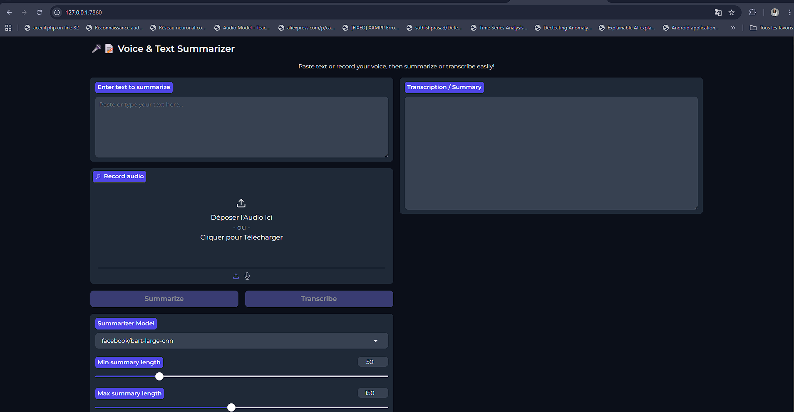

# Voice & Text Summarizer

Ce projet propose une **interface utilisateur** permettant de **transcrire de l'audio** et de **résumer du texte** ou des articles grâce à des modèles avancés de traitement du langage naturel.

## Fonctionnalités

- Résumer rapidement n'importe quel texte ou article
- Transcrire de l'audio enregistré en texte
- Choisir le modèle de résumé et ajuster les paramètres (longueur, beams, etc.)
- Interface simple et intuitive

## Installation

1. Clonez le dépôt :
   ```bash
   git clone https://github.com/votre-utilisateur/Trans-summarizer.git
   cd Trans-summarizer
   ```
2. Installez les dépendances Python :
   ```bash
   pip install -r requirements.txt
   ```
   ou lancez via Docker :
   ```bash
   docker build -t trans-summarizer .
   docker run -p 7860:7860 trans-summarizer
   ```

## Utilisation

1. Lancez l'application :
   ```bash
   python gradio_app.py
   ```
   ou via Docker comme indiqué ci-dessus.
2. Ouvrez votre navigateur à l'adresse affichée (par défaut http://localhost:7860).
3. Utilisez l'interface pour :
   - Saisir ou coller du texte à résumer
   - Enregistrer votre voix pour la transcription
   - Choisir le modèle et les paramètres de résumé
   - Lire le résultat dans la boîte de sortie

## Contribution

Les contributions sont les bienvenues ! N'hésitez pas à ouvrir une issue ou une pull request.

## Licence

Ce projet est sous licence MIT.




